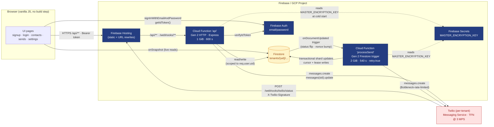
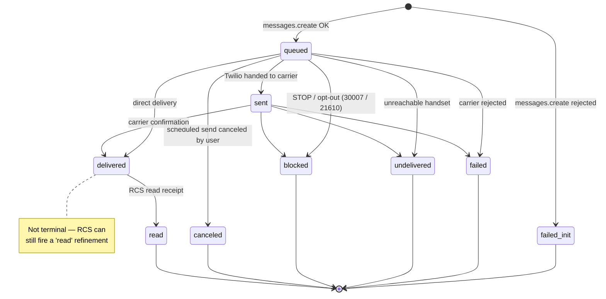
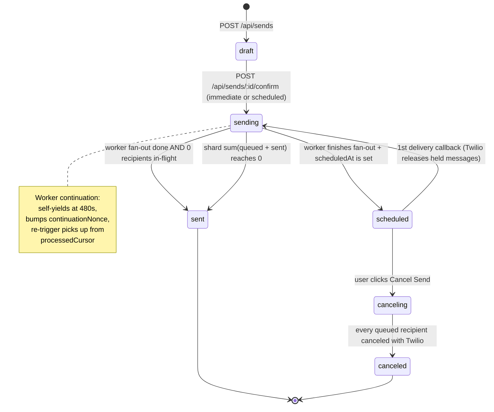
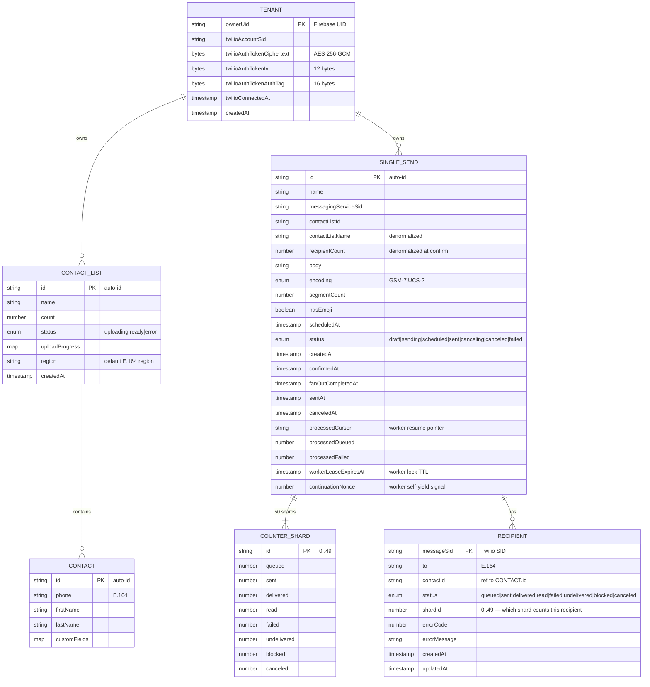
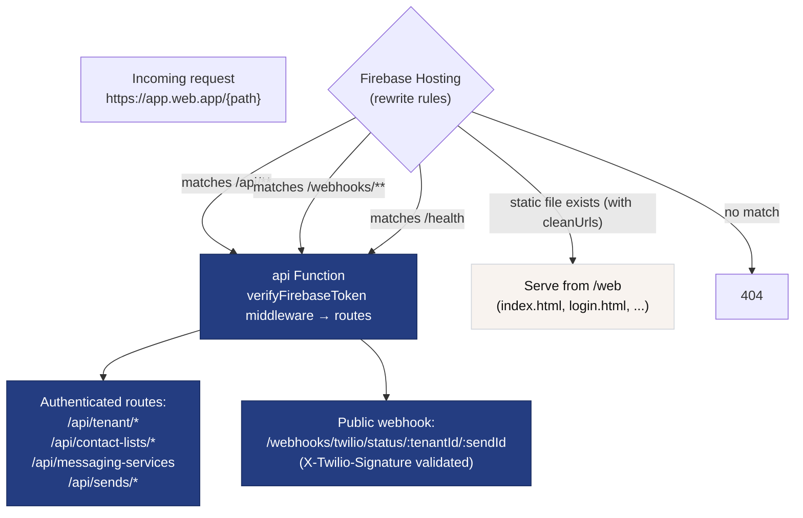
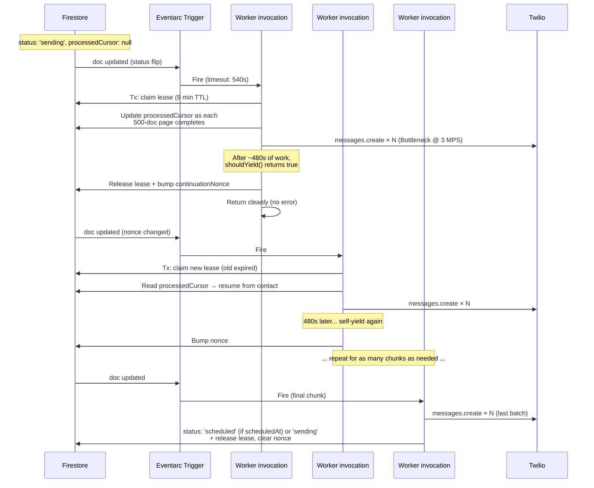
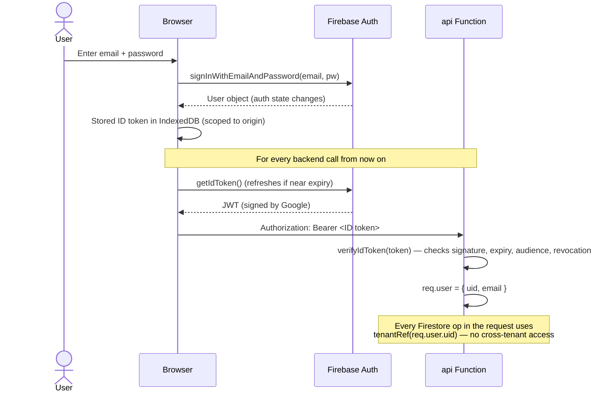
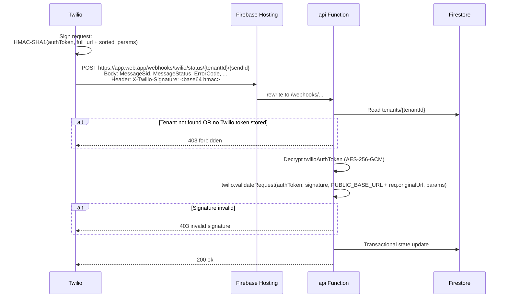
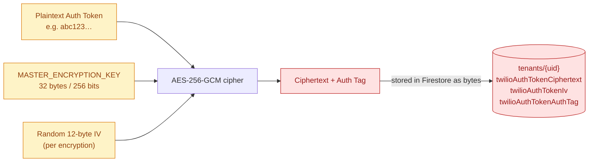

# Twilio SMS Campaigns — Architecture Diagrams

All diagrams below are written in [Mermaid](https://mermaid.js.org/). GitHub renders them inline. For local preview, use the VS Code Mermaid extension or `npx @mermaid-js/mermaid-cli -i architecture.md`.

---

## 1. System overview

The bird's-eye view of every running component and the network paths between them.



---

## 2. Single Send lifecycle (sequence)

How a Single Send moves from a user clicking "Confirm" through fan-out to Twilio and the resulting status callbacks updating the UI in real time.

```mermaid
sequenceDiagram
    actor User
    participant UI as Browser
    participant API as api Function
    participant FS as Firestore
    participant Worker as processSend Worker
    participant T as Twilio

    User->>UI: Fill composer, click "Review & Send" → Confirm
    UI->>API: POST /api/sends (draft body)
    API->>FS: Write singleSends/{id} {status:'draft', body, segmentCount, ...}
    API-->>UI: { sendId }

    UI->>API: POST /api/sends/{id}/confirm
    API->>FS: Init 50 counter shards (all counters = 0)
    API->>FS: Update {status:'sending', recipientCount, processedCursor:null}
    API-->>UI: 200 OK (returns immediately)

    Note over FS,Worker: Firestore trigger fires on status → 'sending'<br/>OR on later continuationNonce bumps
    FS->>Worker: Eventarc trigger
    Worker->>FS: Transactional lease claim (workerLeaseExpiresAt)
    Worker->>FS: Read send doc + cursor + Twilio creds (decrypted)

    loop For each contact page (500 docs)
        loop Per contact (Bottleneck @ 3 MPS)
            Worker->>T: messages.create({to, body, statusCallback, sendAt?})
            T-->>Worker: { sid: SMxxxx, status: 'queued' }
            Worker->>FS: Tx: write recipients/{sid} + shard.queued += 1
        end
        Worker->>FS: Update processedCursor + extend lease
    end

    alt Time budget exhausted (~480s)
        Worker->>FS: Release lease + bump continuationNonce
        Note over FS,Worker: Trigger re-fires on nonce change → fresh worker resumes
        FS->>Worker: Eventarc trigger (continuation)
    end

    Worker->>FS: Update {status:'scheduled' or 'sending', fanOutCompletedAt}
    Note over T: Twilio holds scheduled msgs until sendAt;<br/>immediate sends go out now

    loop For each delivered/failed message
        T-->>API: POST /webhooks/twilio/status (X-Twilio-Signature)
        API->>API: Decrypt tenant authToken + validate signature
        API->>FS: Tx: update recipient status + swap shard counter
        FS-->>UI: onSnapshot pushes new counter values
        UI->>UI: Animate tile to new value
    end

    Note over API,FS: After each terminal callback, sum (queued + sent) across<br/>all 50 shards. When 0, flip send doc → status:'sent'
```

---

## 3. Per-recipient state machine

Every `recipients/{messageSid}` document advances through these states. Transitions are **forward-only** and enforced by `canTransition()` inside the webhook transaction — duplicate or out-of-order Twilio callbacks are silent no-ops.



Error-code → internal-status mapping (see `functions/sendsStateMachine.js#mapTwilioStatus`):

| Twilio MessageStatus | ErrorCode | Internal status |
|---|---|---|
| `delivered` | — | `delivered` |
| `read` | — | `read` |
| `sent` | — | `sent` |
| `failed` | `30007` or `21610` | `blocked` |
| `failed` | any other | `failed` |
| `undelivered` | `21610` | `blocked` |
| `undelivered` | `30003`/`30004`/`30005` | `undelivered` |
| `undelivered` | any other | `undelivered` |
| `canceled` | — | `canceled` |
| anything else | — | (no state change) |

---

## 4. Send-level state machine

The parent `singleSends/{sendId}` document has its own status, which is a function of the worker's progress AND aggregate recipient state. The webhook handler advances this status as delivery progresses.



---

## 5. Firestore data model

Multi-tenant, root collection is `tenants`. Every read/write from the backend is scoped to `tenantRef(req.user.uid)` so cross-tenant access is structurally impossible.



Firestore document paths:

```
tenants/{uid}
tenants/{uid}/contactLists/{listId}
tenants/{uid}/contactLists/{listId}/contacts/{contactId}
tenants/{uid}/singleSends/{sendId}
tenants/{uid}/singleSends/{sendId}/counterShards/{0..49}
tenants/{uid}/singleSends/{sendId}/recipients/{messageSid}
```

Security rules:
- **Reads** are scoped to `request.auth.uid == ownerUid` (recursively for all subcollections).
- **Writes** from the client are denied entirely. Every mutation goes through the Cloud Function.

---

## 6. Request routing through Firebase Hosting

How a single URL gets to the right backend.



Why `/api/**` and not bare paths: Firebase Hosting's `cleanUrls: true` matches `/sends` to the static `sends.html` file *before* trying rewrites. Putting authenticated APIs under `/api` avoids the static/dynamic collision.

---

## 7. Multi-chunk worker invocation

Why one logical "Single Send" can take 50+ Cloud Function invocations to deliver — and how the cursor + lease + nonce primitives chain them safely.



Crash semantics:
- If a worker invocation crashes mid-chunk (timeout, OOM, unhandled exception), the lease (`workerLeaseExpiresAt`) eventually expires (~9 minutes after claim).
- `retry: true` on the Eventarc trigger causes Eventarc to redeliver the event with exponential backoff. The retry's worker tries to claim the lease; once expired, it succeeds and resumes from `processedCursor`.
- Cursor is per-page, so at most 500 contacts could be retried — but each Twilio call uses the contact's stable doc ID as the cursor key, and the `recipients/{messageSid}` doc would already exist for already-processed contacts. Duplicate `messages.create` is prevented by the cursor advancing past completed pages.

---

## 8. Authentication flow

How a user's credentials become a backend-authenticated request.



ID tokens expire after 1 hour. The Firebase JS SDK auto-refreshes them before expiry. Server-side verification calls Google's public-key cache.

---

## 9. Twilio webhook signature validation

Why an attacker can't forge status callbacks.



**Why this is safe even with the URL containing public IDs:**

- An attacker would need to compute a valid HMAC-SHA1 over the request, which requires the tenant's Twilio Auth Token.
- The Auth Token is AES-256-GCM-encrypted in Firestore. Decryption requires the `MASTER_ENCRYPTION_KEY` Firebase Secret, which only the Cloud Functions runtime has access to.
- Without the Auth Token, every forged request returns 403.
- If an attacker did compromise the customer's Twilio account, they already have far more than just webhook access.

---

## 10. Encryption flow for stored Twilio credentials

Each tenant's Twilio Auth Token is AES-256-GCM-encrypted using a single master key.



- The master key never leaves the Cloud Functions runtime memory.
- Decryption only happens at the moment a Twilio API call is needed (signature validation, fan-out, cancel).
- The Auth Tag (GCM's MAC) ensures tampering with the stored ciphertext or IV is detected — `decipher.final()` throws.

---

## How to update these diagrams

Edit this file. Mermaid blocks are plain text — no rendering toolchain required. GitHub renders them natively in this README; locally use `npx @mermaid-js/mermaid-cli@latest -i architecture.md -o architecture.svg` to produce SVGs if you want to drop them into a presentation or doc.
